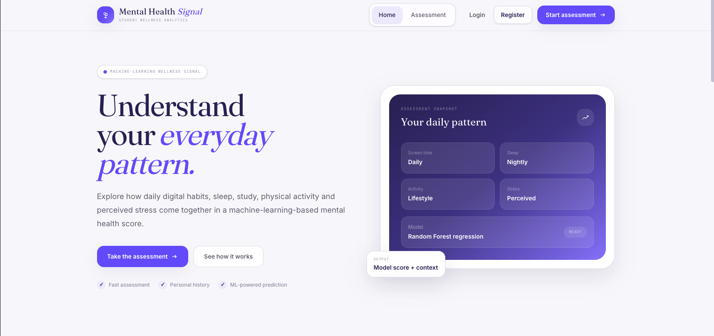
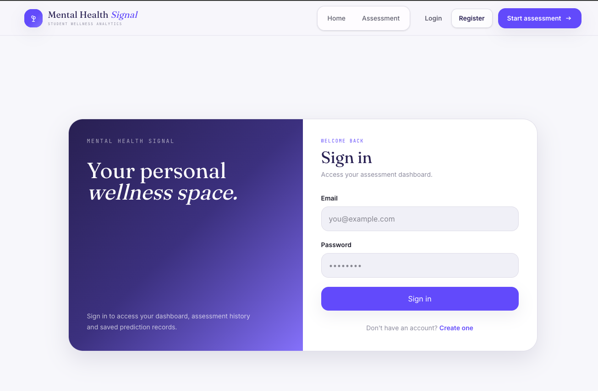
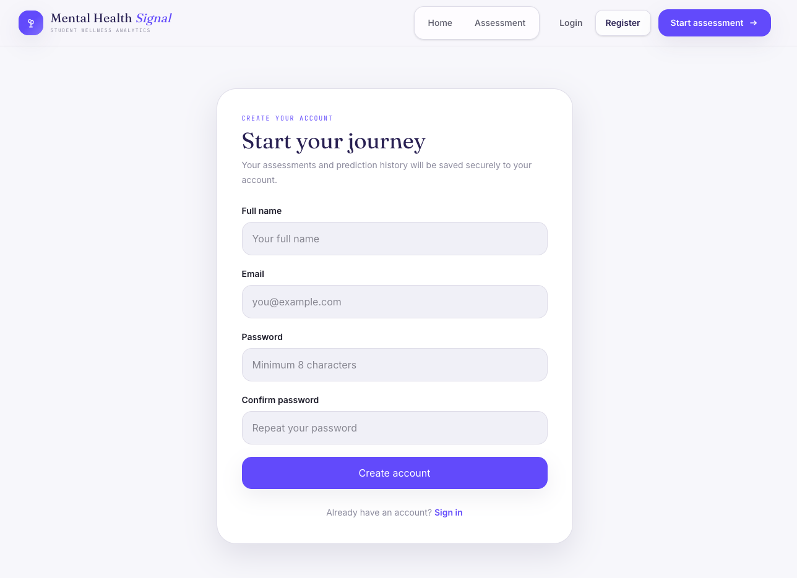
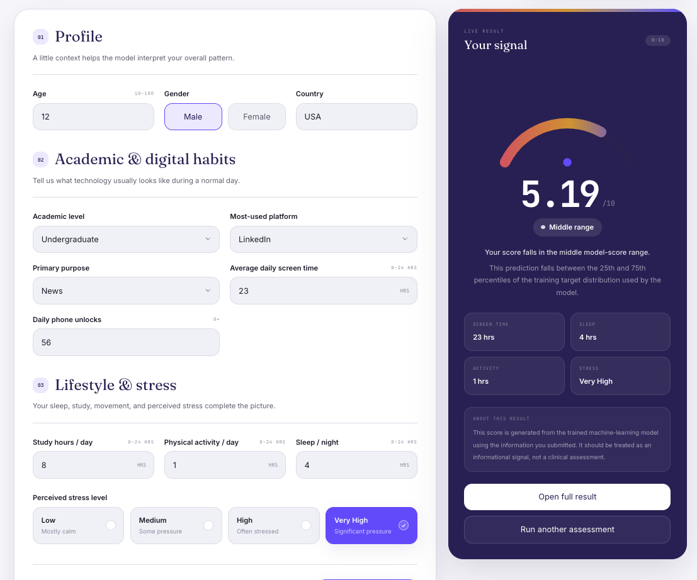
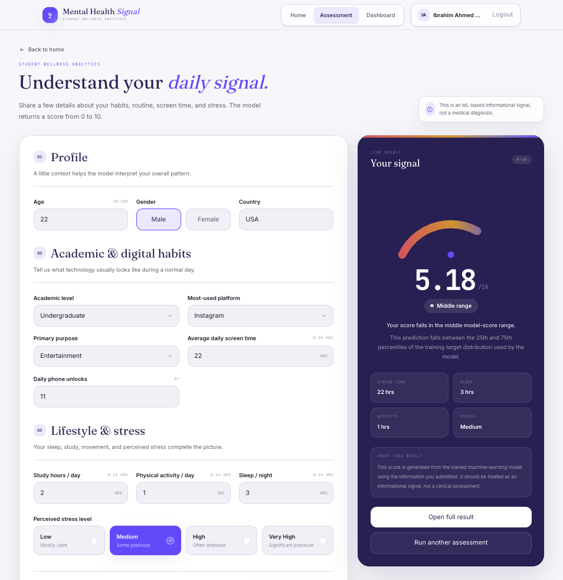

# Mental Health Signal

> A machine-learning powered student wellness exploration platform that turns everyday habits, digital behavior, lifestyle patterns, and perceived stress into an informational mental health score.

<p align="center">
  
</p>

## Overview

**Mental Health Signal** is a full-stack machine-learning web application designed around student wellness exploration. Users can create an account, complete a structured assessment, receive a model-generated score, and keep their assessment history associated with their account.

The project combines a trained regression model with a modern React frontend, a FastAPI backend, MongoDB Atlas for persistence, and JWT-based authentication.

> **Important:** The application provides an ML-based informational signal. It is not a medical diagnosis and should not be treated as a substitute for professional care.

## Highlights

- Modern React + Vite interface with a custom indigo/lavender visual system
- Responsive navigation with authentication-aware states
- Register, login, logout, and current-user authentication flow
- JWT-protected assessment and dashboard endpoints
- Random Forest regression model for score prediction
- MongoDB Atlas storage for users and assessment history
- User-specific dashboard statistics and recent predictions
- Data-derived score ranges based on the training target distribution
- Informational result language rather than clinical labels

## Screenshots

### Home

<p align="center">
  
</p>

### Sign In

<p align="center">
  
</p>

### Register

<p align="center">
  
</p>

### Assessment — Live Result Panel

<p align="center">
  
</p>

### Assessment — Result Presentation

<p align="center">
  
</p>
## How It Works

```text
User
  │
  ├── Register / Login
  │       │
  │       └── JWT access token
  │
  └── Assessment
          │
          ├── Validate input with Pydantic
          ├── Prepare model input
          ├── Run Random Forest regression model
          ├── Generate mental health score
          └── Save assessment + user_id in MongoDB
                      │
                      └── Dashboard
                          ├── Total assessments
                          ├── Average model score
                          ├── Latest model score
                          └── Recent assessment history
```

## Tech Stack

### Frontend

- React
- Vite
- Tailwind CSS
- Axios
- React Router

### Backend

- Python
- FastAPI
- Pydantic
- Uvicorn
- Joblib
- Pandas
- scikit-learn

### Data & Authentication

- MongoDB Atlas
- PyMongo `AsyncMongoClient`
- JWT / PyJWT
- `pwdlib` with Argon2 password hashing

## Machine Learning Model

The application uses a trained **Random Forest Regressor** pipeline to predict the `Mental_Health_Score` from student profile, digital behavior, academic routine, lifestyle, and perceived-stress inputs.

### Reported Test Metrics

| Metric | Default Random Forest | Tuned Random Forest |
|---|---:|---:|
| R² | 0.8776 | 0.8650 |
| MAE | 0.3472 | 0.3689 |
| RMSE | 0.4637 | 0.4869 |

The project currently uses the saved model artifact in `backend/Mental_Health_Model.pkl`.

## Score Distribution & Interpretation

The training target distribution used for score-range interpretation was:

| Statistic | Value |
|---|---:|
| Count | 3,498 |
| Mean | 6.2133 |
| Standard deviation | 1.2574 |
| Minimum | 3.6 |
| Q25 | 5.1 |
| Median | 6.0 |
| Q75 | 7.0 |
| Maximum | 9.4 |

The UI therefore uses these relative ranges:

```text
Score < 5.1      → Lower range
5.1 to 7.0       → Middle range
Score > 7.0      → Higher range
```

These labels describe a prediction's position relative to the model's training target distribution. They are **not clinical categories**.

## Authentication Flow

```text
Register
  ↓
Password hashing
  ↓
User stored in MongoDB
  ↓
JWT access token returned
  ↓
Token stored client-side
  ↓
Authorization: Bearer <token>
  ↓
Protected API access
```

Protected endpoints include:

- `GET /api/auth/me`
- `GET /api/dashboard`
- `POST /predict`

## API Endpoints

| Method | Endpoint | Auth | Purpose |
|---|---|---|---|
| GET | `/` | No | API health / welcome response |
| POST | `/api/auth/register` | No | Create account |
| POST | `/api/auth/login` | No | Authenticate user |
| GET | `/api/auth/me` | Yes | Return current user |
| GET | `/api/dashboard` | Yes | User dashboard data |
| POST | `/predict` | Yes | Generate and store prediction |

Interactive API documentation is available at:

`http://127.0.0.1:8000/docs`

## Project Structure

```text
Mental Health Prediction/
│
├── backend/
│   ├── auth/
│   │   ├── __init__.py
│   │   ├── routes.py
│   │   ├── schemas.py
│   │   └── security.py
│   │
│   ├── database/
│   │   ├── __init__.py
│   │   └── mongodb.py
│   │
│   ├── routes/
│   │   ├── __init__.py
│   │   └── dashboard.py
│   │
│   ├── Mental_Health_Model.pkl
│   ├── main.py
│   ├── requirements.txt
│   └── .env
│
├── frontend/
│   ├── src/
│   │   ├── components/
│   │   ├── context/
│   │   ├── layouts/
│   │   ├── pages/
│   │   ├── services/
│   │   └── utils/
│   │
│   ├── package.json
│   └── vite.config.js
│
├── screenshots/
│   ├── home-page.png
│   ├── sign-in.png
│   ├── register-page.png
│   ├── assessment-live.png
│   └── assessment-result.png
│
└── README.md
```

## Local Setup

### 1. Clone the Repository

```bash
git clone https://github.com/galibhub/Mental-Health-Prediction.git
cd Mental-Health-Prediction
```

### 2. Backend Setup

```bash
cd backend
python3.12 -m venv .venv312
source .venv312/bin/activate
python -m pip install -r requirements.txt
```

Create `backend/.env`:

```env
MONGODB_URI=your_mongodb_atlas_connection_string
MONGODB_DATABASE=mental_health_db
JWT_SECRET_KEY=your_long_random_secret
JWT_ALGORITHM=HS256
JWT_EXPIRE_MINUTES=10080
```

Start FastAPI:

```bash
uvicorn main:app --reload
```

Backend:

```text
http://127.0.0.1:8000
```

Swagger:

```text
http://127.0.0.1:8000/docs
```

### 3. Frontend Setup

Open a second terminal:

```bash
cd frontend
npm install
npm run dev
```

Frontend:

```text
http://localhost:5173
```

## MongoDB Data Model

### `users`

```text
_id
full_name
email
password_hash
created_at
```

### `assessments`

```text
_id
user_id
created_at
input
prediction
```

The `user_id` field links each prediction to the authenticated account, allowing the dashboard to return only that user's records.

## Security Notes

- Passwords are stored as hashes, not plaintext.
- JWT secrets belong in environment variables.
- `.env` should never be committed to Git.
- Protected endpoints require a valid bearer token.
- Assessment records are scoped by authenticated `user_id`.

## Development Notes

The project is intentionally structured as a learning-first full-stack ML application. The frontend, API, authentication layer, database layer, and model inference flow are kept as separate responsibilities so each part can be tested independently.

## Repository

[GitHub — Mental Health Prediction](https://github.com/galibhub/Mental-Health-Prediction)

## Disclaimer

Mental Health Signal is an educational and informational machine-learning application. Its output reflects a model prediction based on the information provided to the system and should not be interpreted as a medical diagnosis, clinical assessment, or professional recommendation.
